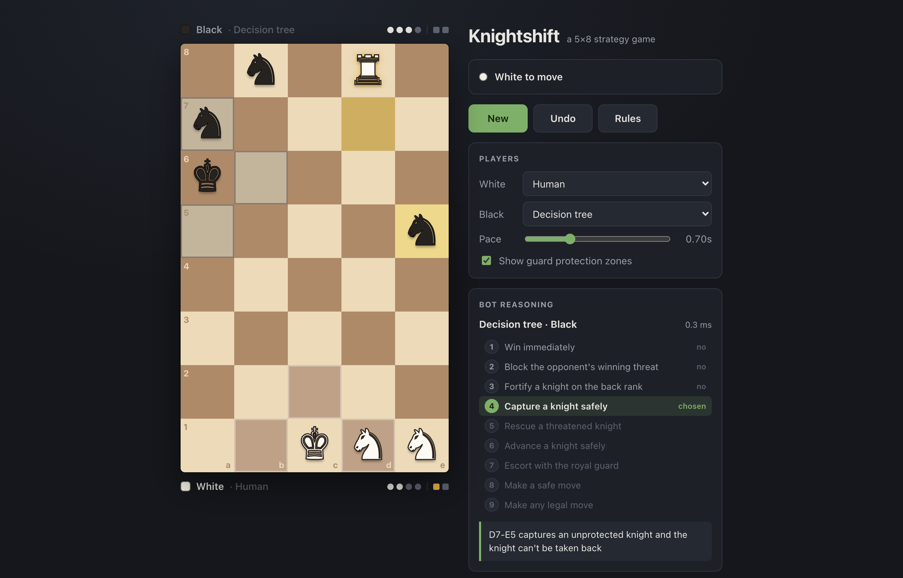

# Knightshift

Knightshift is a two-player strategy game on a 5×8 board, inspired by chess. Each side has knights and a royal guard. You win by getting knights across the board and turning them into fortresses, or by capturing the enemy's knights.

The game is written in C. It comes with three computer opponents, a browser UI served by a small HTTP server (also in C) and a terminal version. Nothing needs to be installed beyond a C compiler.

## Demo

[](docs/knightshift-demo-vid.mp4)

▶ **[Watch the demo video](docs/knightshift-demo-vid.mp4)**

---

## Contents

- [Quick start](#quick-start)
- [Rules of the game](#rules-of-the-game)
- [Playing in the browser](#playing-in-the-browser)
- [Playing in the terminal](#playing-in-the-terminal)
- [How the game works](#how-the-game-works)
- [The bots](#the-bots)
- [Project structure](#project-structure)
- [Web server API](#web-server-api)
- [Tests](#tests)

---

## Quick start

Requirements: a C compiler (`clang` or `gcc`) and `make`. Works on macOS and Linux.

```sh
git clone https://github.com/zack-parisi/knightshift.git
cd knightshift

make web     # build and start the browser UI at http://localhost:8080
make play    # play in the terminal instead
make test    # run the test suite
```

| Command | What it does |
|---|---|
| `make` | Builds `build/knightshift` (terminal) and `build/knightshift-web` (server) |
| `make web` | Builds and starts the web server |
| `make play` | Builds and starts the terminal game |
| `make test` | Builds and runs the test suite |
| `make clean` | Deletes the `build/` folder |

---

## Rules of the game

### The board

The board has **5 files** (columns A–E) and **8 ranks** (rows 1–8). White starts on rank 1 and Black starts on rank 8.

```
     A   B   C   D   E
 8   ♞   ♞   ♚   ♞   ♞     ← Black's home rank (White's goal)
 7   .   .   .   .   .
 6   .   .   .   .   .
 5   .   .   .   .   .
 4   .   .   .   .   .
 3   .   .   .   .   .
 2   .   .   .   .   .
 1   ♘   ♘   ♔   ♘   ♘     ← White's home rank (Black's goal)
```

Each side starts with **four knights** (on files A, B, D and E) and **one royal guard** (on file C).

### Turns

White moves first, then the players alternate. On your turn you must do exactly **one** of these:

1. **Move** one of your pieces, or
2. **Fortify** one of your knights (see below).

You can't pass.

### The pieces

#### ♞ Knight
- **Moves** in an L-shape, exactly like a chess knight: two squares in one direction and one square sideways. It jumps over any pieces in between.
- **Captures** by landing on an enemy knight, but only if that knight is **unprotected** (see [Protection](#protection)).
- Can't capture guards or fortresses, and can't land on a friendly piece.

#### ♚ Royal guard
- **Moves** one square in any direction (horizontally, vertically or diagonally), like a chess king.
- **Captures** by stepping onto an enemy knight, but only if that knight is **unprotected**.
- **Protects** the friendly knights directly beside it (see below).
- **Can't step next to the enemy guard.** A guard may never end its move on a square directly above, below, left or right of the enemy guard. Diagonally next to it is allowed.
- **Can never be captured.** No piece is able to take a guard.

#### ♜ Fortress
- A fortress is a knight that has been **fortified**.
- It **never moves** and **can never be captured**.
- It counts toward the two-fortress win.

### Protection

A knight is **protected** when its own royal guard is directly beside it, **up, down, left or right** (not diagonally). A protected knight can't be captured by anything.

```
 .   .   .        In this picture, ♔ protects the knights at
 ♘   ♔   ♘        left, right and below it. The knight diagonal
 ♘   ♘   .        to the guard (bottom-left) is NOT protected.
```

So a guard can protect at most four knights at once. Moving your guard to keep advanced knights protected is a key part of the game.

### Fortifying

If one of your knights is on the **enemy's home rank** (rank 8 for White, rank 1 for Black), you can spend your turn to **fortify** it. The knight becomes a fortress on the same square.

- Fortifying uses up your whole turn.
- Once fortified, the piece is permanent: it can't move and can't be captured.
- A fortress **no longer counts as a knight** (this matters for the capture win below).

### Winning

The game is checked for a winner after every turn. You win if either:

1. **Two fortresses:** you have two fortresses on the board, or
2. **Captures:** your opponent is down to **exactly one knight**.

The game calls the second condition "three captures", because it usually means you have taken three of the opponent's four knights. Fortified knights stop counting as knights, though. A player who has built one fortress and then loses two knights has a single knight left, and loses.

### Edge cases

- There is no check, checkmate or draw rule.
- A side with no legal move and no fortification has nothing to play. This is very rare, because the guard can almost always move. The bots report it, and the game can't continue.
- An illegal move is rejected, and the same player moves again.

### Strategy tips

- Unprotected knights in the middle of the board are easy targets. Move your guard up behind your advancing knights.
- The guard can't be captured, which makes it an excellent attacker against loose knights.
- Each knight you fortify protects itself forever but reduces your knight count. Don't fortify one, then lose two knights in the fight.
- Watch for enemy knights that reach your back rank: unless you capture them, they will fortify next turn.

---

## Playing in the browser

Start the server with `make web` and open **http://localhost:8080**.

### Moving pieces
- **Click** one of your pieces to select it. Legal moves are marked with dots, and legal captures with red rings. Click a marked square to move.
- **Drag and drop** also works.
- Click the selected piece again, or press **Esc**, to deselect.
- **Fortify:** when a knight can be fortified, a gold ♜ badge pulses on it. Click the badge, select the knight and press the *Fortify* button, or press **F**.

### The panel

| Section | What it shows |
|---|---|
| **Status** | Whose turn it is, whether a bot is thinking, and who won |
| **New / Undo / Pause / Rules** | Start over, take back a move, pause a bot-vs-bot game, show the rules |
| **Players** | Choose Human, *Minimax · material*, *Minimax · positional*, *Decision tree* or *Random* for each side |
| **Depth** | How many moves ahead minimax looks (1–7) |
| **Pace** | Delay before each bot move, useful for watching bot-vs-bot games |
| **Guard protection zones** | Shades the squares each guard protects |
| **Bot reasoning** | How the bot chose its last move (see below) |
| **Moves** | Numbered move list (`×` marks a capture, ♜ marks a fortification) |

The bar above and below the board shows each player's remaining knights (circles) and fortresses (gold squares).

**Bot reasoning:**
- **Minimax:** the move played, the evaluation (positive is good for White), the search depth, how many positions were examined, the search time, and an evaluation bar. If the bot sees a forced win, it shows "White wins in N".
- **Decision tree:** all nine rules in order. Rules that were checked and didn't apply are marked *no*, and the rule that produced the move is marked *chosen*. A one-line explanation of the move appears below.

### Game modes
- **Human vs. bot:** set one side to Human. If only Black is human, the board flips so Black is at the bottom.
- **Bot vs. bot:** set both sides to bots and they play automatically. Use **Pause** and **Pace** to control the game.
- **Human vs. human:** set both sides to Human for two people on one screen.

**Undo** goes back to the last position where a human was to move, so in a human-vs-bot game it takes back both your move and the bot's reply. Your player settings are saved in the browser. The game itself lives on the server, so refreshing the page keeps the current game.

---

## Playing in the terminal

```sh
make play                                   # you play White vs. minimax (Black)
./build/knightshift --bot tree              # play against the decision tree
./build/knightshift --bot positional --depth 6
./build/knightshift --bot random
./build/knightshift --watch --bot minimax   # watch decision tree (White) vs. minimax (Black)
```

| Option | Meaning |
|---|---|
| `--bot minimax\|positional\|tree\|random` | Black's algorithm (default `minimax`) |
| `--depth N` | Minimax search depth, 1–8 (default 5) |
| `--watch` | Bot vs. bot: the decision tree plays White against the chosen bot |

Commands ignore case and spaces:

| Command | Example | Meaning |
|---|---|---|
| Move | `B1 C3`, `b1c3` or `M B1 C3` | Move the piece on B1 to C3 |
| Fortify | `F A8` | Fortify your knight on A8 |
| Help | `H` | Show help |
| Quit | `Q` | Exit |

The board is printed with Unicode chess symbols: ♘ ♞ knights, ♔ ♚ guards, ♖ ♜ fortresses. Empty squares are shown as `~` or blank, alternating like a checkerboard.

---

## How the game works

The rules engine is in [`src/knightshift.c`](src/knightshift.c).

### Data model

```c
typedef enum { BLACK, WHITE } color;
typedef enum { KNIGHT, ROYAL_GUARD, FORTRESS } piece_type;

typedef struct { color color; piece_type type; } piece;
typedef struct { piece *squares[40]; } board;     // NULL = empty square
typedef struct { char file; char rank; } loc;     // e.g. {'B', 3}
typedef struct { loc src; loc dst; } move;
```

- **Board:** a flat array of 40 piece pointers. A location maps to index `(rank - 1) * 5 + (file - 'A')`, so A1 is index 0 and E8 is index 39.
- **Lists:** move lists and location lists are singly linked lists (`move_list`, `loc_list`).
- **Copying and freeing:** `board_dup` makes a deep copy and `board_free` frees a board and every piece on it.

### Move generation

`available_moves(board, color)` walks every piece of the given color:
- **Knights:** `adjacent_knight` lists the up-to-8 L-shaped destinations on the board, and each one is checked with `legal_knight`.
- **Guards:** `adjacent_guard` lists the up-to-8 neighboring squares, and each one is checked with `legal_guard`.

`available_fortifications(board, color)` returns the squares on the enemy's home rank that hold one of your knights.

### Legality checks

| Function | A move is legal when… |
|---|---|
| `legal_knight` | the source holds your knight, the move is L-shaped, and the destination is empty or holds an **unprotected** enemy knight |
| `legal_guard` | the source holds your guard, the move is one step, the destination isn't beside the enemy guard (up, down, left or right), and it's empty or holds an unprotected enemy knight |
| `protected_knight_at` | a knight is protected if a guard of its own color is directly beside it (up, down, left or right) |

### Applying a turn

- **`apply_move(board, move, color, &outcome)`** validates the move and performs it. It returns the captured piece, or `NULL` if nothing was captured. `outcome` is `0` on success or an error code:

| Error code | Meaning |
|---|---|
| `ERR_NO_PIECE` | there's no piece on the source square |
| `ERR_BAD_MOVE` | wrong color, or an illegal shape or target |
| `ERR_FRIENDLY` | the destination holds your own piece |
| `ERR_BAD_LOCATION` | the square is off the board |

- **`fortify(board, loc, color, &outcome)`** turns the knight into a fortress. It reports `ERR_BAD_LOCATION` (not the enemy home rank), `ERR_NO_PIECE`, `ERR_PIECE_TYPE` (not a knight) or `ERR_BAD_MOVE` (not your piece).

### Detecting the end of the game

`game_over(board)` counts each side's knights and fortresses. It returns `0` while the game is still going, or one of:
- `VICTORY_WHITE_TWO_FORTRESSES`
- `VICTORY_BLACK_TWO_FORTRESSES`
- `VICTORY_WHITE_THREE_CAPTURES` (Black is down to one knight)
- `VICTORY_BLACK_THREE_CAPTURES` (White is down to one knight)

`victory_winner()` turns any of these into the winning color.

### Actions

The bots and the web server use a single `action` type, which is either a move or a fortification:

```c
typedef struct {
  action_kind kind;   // ACTION_NONE, ACTION_MOVE or ACTION_FORTIFY
  move m;             // used when kind == ACTION_MOVE
  loc fort;           // used when kind == ACTION_FORTIFY
} action;
```

`action_apply()` plays an action on a board and reports whether it captured something. `action_str()` formats it as `"B1-C3"` or `"F A8"`.

---

## The bots

All three bots are in [`src/bot.c`](src/bot.c). Each one looks at a board and the side to move, and returns an `action`.

### 1. Minimax with alpha-beta pruning

**Minimax** builds a tree of possible futures: every move the bot can make, every reply the opponent can make to each of those, and so on, down to a fixed **depth** (number of plies, i.e. single moves by one player). At the bottom of the tree, it scores each position with an **evaluation function**.

- Scores are always from **White's** point of view: positive is good for White and negative is good for Black.
- White picks the move with the **highest** score and Black the move with the **lowest**, assuming the opponent always replies with their best move.

**Alpha-beta pruning** skips branches that can't change the decision. If one of the bot's moves is already known to be worse than an option it has already found, the rest of that branch isn't explored. Pruning works best when strong moves are tried first, so moves are ordered **fortifications → captures → other moves**.

| Search from the opening, depth 5 | Positions visited |
|---|---|
| Plain minimax (no pruning) | millions |
| With alpha-beta and move ordering | about 4,100 (about 6 ms) |

**Wins and losses.** A finished game is scored as `±(100000 − ply)`, where `ply` is how many moves into the search the win happens. Any win outranks any material score, and a quicker win scores higher. So the bot takes the fastest win and delays a loss as long as possible.

**Ties.** When two moves score the same, the bot keeps the first one it found. The bot has no randomness, so the same position always gets the same reply.

#### Evaluation functions

Both return *White's score − Black's score*.

**Material** (`eval_material`), shown in the UI as *Minimax · material*:

| Item | Points |
|---|---|
| Knight | 3 |
| Fortress | 10 |
| Royal guard | 0 (it can never be captured, so it's never gained or lost) |

**Positional** (`eval_positional`), shown in the UI as *Minimax · positional*:

| Item | Points |
|---|---|
| Material (as above) | 3 per knight, 10 per fortress |
| Each protected knight | +2 |
| Mobility | +1 per legal move available |
| Each knight ready to fortify (on the enemy home rank) | +5 |

The positional evaluation knows more, but it's slower: computing mobility means generating every legal move at every position in the search tree.

### 2. Decision tree (rule-based)

The decision tree doesn't search far ahead. It checks a fixed list of questions in priority order, and **the first rule that finds an acceptable move decides**. Before applying the rules, it looks one move ahead for every candidate action and records:
- whether the action captures,
- whether it wins,
- whether it lets the opponent win on their next turn,
- how many of the bot's knights would be open to capture afterward,
- whether the piece that moved could be captured.

| # | Rule | Fires when… |
|---|---|---|
| 1 | **Win immediately** | an action ends the game in the bot's favor |
| 2 | **Block the opponent's winning threat** | the opponent could win next turn; picks an action that prevents it, preferring captures |
| 3 | **Fortify a knight on the back rank** | a knight can be fortified (fortresses can never be lost) |
| 4 | **Capture a knight safely** | a capture is available and the capturing piece can't be taken back (guard captures are always safe) |
| 5 | **Rescue a threatened knight** | one of its knights is open to capture; picks the action that leaves the fewest knights open to capture |
| 6 | **Advance a knight safely** | a knight can move closer to the enemy home rank to a square where it can't be captured; picks the most advanced square |
| 7 | **Escort with the royal guard** | the guard can move closer to the bot's most advanced knight |
| 8 | **Make a safe move** | an action leaves every piece safe |
| 9 | **Make any legal move** | fallback |

Rules 3 to 9 never pick an action that lets the opponent win on the next turn, unless every action does.

The tree takes under a millisecond per move, and every decision comes with a plain-English reason, which the UI shows.

### How the bots compare

Results of bot-vs-bot games (depth 5 for minimax; a game with no winner after 300 moves counts as no result):

| White | Black | Result |
|---|---|---|
| Decision tree | Random | Decision tree wins (every game tested) |
| Decision tree | Minimax · material | Minimax wins by captures |
| Minimax · material | Decision tree | **Decision tree wins** with two fortresses |
| Decision tree | Minimax · positional | No result |
| Minimax · positional | Decision tree | No result |
| Minimax · material | Minimax · positional | No result |

Neither bot is strictly better, and the reasons are useful:
- **Minimax with the material evaluation** is tactically sharp. It never leaves a knight hanging and punishes the tree's mistakes. But the material score gives no credit for advancing, so when nothing can be captured within its search depth, it wanders. The tree marches its knights forward and fortifies before minimax sees the danger: a classic *horizon effect*.
- **The positional evaluation** fixes the wandering but plays so cautiously that games against the tree go nowhere.

Improving this is the obvious next step: give the evaluation a bonus for knight advancement, or add a quiescence search.

### 3. Random

`random_action` picks a uniformly random legal action. It's a baseline for measuring the other bots.

---

## Project structure

```
knightshift/
├── Makefile                 build, run and test targets
├── README.md
├── .gitignore
├── docs/
│   └── screenshot.png       image used in this README
├── src/
│   ├── knightshift.h        engine API: types, constants, function declarations
│   ├── knightshift.c        engine: board, move generation, rules, win detection
│   ├── bot.h                bot API: action type, evaluations, minimax, decision tree
│   ├── bot.c                bot implementations
│   ├── cli.c                terminal game (main for build/knightshift)
│   └── server.c             HTTP server + JSON API (main for build/knightshift-web)
├── web/
│   └── index.html           browser UI (HTML, CSS and JavaScript in one file)
└── tests/
    └── test_knightshift.c   test suite (no external framework)
```

### `src/knightshift.h` / `src/knightshift.c`: rules engine
The core of the game, used by every other part of the project. Contents:
- **Types:** `piece`, `board`, `loc`, `move` and the linked lists.
- **Constructors and helpers:** `piece_new`, `loc_new`, `move_new`, `board_setup`, `board_empty`, `board_dup`, `board_free`, and `board_from_strings` (builds a board from text, used by the tests).
- **Geometry:** `adjacent_knight`, `adjacent_guard`, `adjacent_ortho`.
- **Rules:** `protected_knight_at`, `legal_knight`, `legal_guard`, `available_moves`, `available_fortifications`, `apply_move`, `fortify`, `game_over`, `victory_winner`.

The engine doesn't print anything and holds no global state, so the terminal game, the server and the tests can all share it.

### `src/bot.h` / `src/bot.c`: computer players
- **`action`:** the move-or-fortify type, with `action_apply` and `action_str`.
- **`gen_actions`:** lists every legal action in a good search order.
- **Evaluations:** `eval_material` and `eval_positional`.
- **`minimax`:** alpha-beta search. It fills in a `search_stats` struct with the number of positions visited and the final score.
- **`decision_tree`:** the rule-based bot. It fills in a `tree_trace` with the rule that fired and a written reason. `tree_rule_names` holds the rule labels the UI displays.
- **`random_action`:** the baseline bot.

### `src/cli.c`: terminal game
Parses typed commands, prints the board with Unicode pieces, and runs the human-vs-bot loop and the `--watch` bot-vs-bot mode. It's built as `build/knightshift`.

### `src/server.c`: web server
A small single-threaded HTTP/1.1 server built on plain POSIX sockets. It listens on `127.0.0.1` only and serves the UI.
- **Game state:** keeps the game as a stack of positions, which makes undo simple.
- **Requests:** handles `/api/...` requests, plays moves or runs bots through the engine, and answers with the full game state as JSON.
- **Bot timing:** measures how long each bot takes and includes it, with the bot's reasoning, in the response.
- **Finding the UI:** looks for `web/index.html` in the current folder, or next to the binary.

It's built as `build/knightshift-web`, and accepts `--port N` (default 8080).

### `web/index.html`: browser UI
A single page with no frameworks or build step. JavaScript draws the board, handles clicks and dragging, animates moves and captures, and shows the bot's reasoning. Every action goes through the C server, so the browser never applies the rules itself.

### `tests/test_knightshift.c`: test suite
A small test runner using `CHECK` macros and no external framework. See [Tests](#tests).

### `Makefile`
Builds both programs and the tests into `build/` with `-std=c11 -Wall -Wextra`.

---

## Web server API

Every endpoint returns the complete game state as JSON.

| Method & path | Parameters | Action |
|---|---|---|
| `GET /api/state` | | Current state |
| `POST /api/new` | | Start a new game |
| `POST /api/move` | `from`, `to` (e.g. `B1`, `C3`) | Play a move for the side to move |
| `POST /api/fortify` | `at` (e.g. `A8`) | Fortify a knight |
| `POST /api/bot` | `algo` = `minimax`, `positional`, `tree` or `random`; `depth` = 1–8 | Let a bot play for the side to move |
| `POST /api/undo` | `plies` (default 1) | Take back that many moves |

Example response (abbreviated):

```json
{
  "board": "kkgkk..............................KKGKK",
  "turn": "white",
  "ply": 0,
  "winner": null,
  "reason": null,
  "moves": [["B1","C3"], ["B1","A3"], ...],
  "forts": [],
  "history": [{"color":"white","text":"B1-C3","capture":false,"kind":"move","from":"B1","to":"C3"}],
  "counts": {"white":{"knights":4,"forts":0}, "black":{"knights":4,"forts":0}},
  "bot": {"algo":"minimax","eval":"material","depth":5,"score":0,"nodes":4122,"color":"black","action":"A8-C7","ms":6.4},
  "error": null
}
```

How the fields work:
- **`board`:** 40 characters, one per square from A1 to E8, rank by rank. `k g f` are White's knight, guard and fortress; `K G F` are Black's; `.` is an empty square.
- **`moves` and `forts`:** the legal actions for the side to move.
- **`error`:** set when a request was rejected, for example an illegal move.

---

## Tests

```sh
make test
```

The suite in [`tests/test_knightshift.c`](tests/test_knightshift.c) covers:

- **Setup and geometry:** the starting position, knight moves at corners and in the center, the number of opening moves.
- **Captures and protection:** capturing unprotected knights, protected knights being immune, diagonal guards not protecting, guards and fortresses being uncapturable, the guard's restricted zone, friendly and enemy pieces.
- **Fortifying:** fortifying on the enemy home rank and every fortify error case.
- **Winning:** two fortresses, being down to one knight, an empty board.
- **Evaluation:** material and positional scores, and the symmetric starting position.
- **Minimax:** compares alpha-beta against a plain minimax written in the test file and checks they give the same result on several positions. Also checks that minimax finds a winning fortification and plays correctly as Black.
- **Decision tree:** winning immediately, blocking a threat, fortifying, capturing safely, opening advances. A 120-move tree-vs-tree game checks that every action it picks is legal.
- **Random bot:** always picks legal actions.
